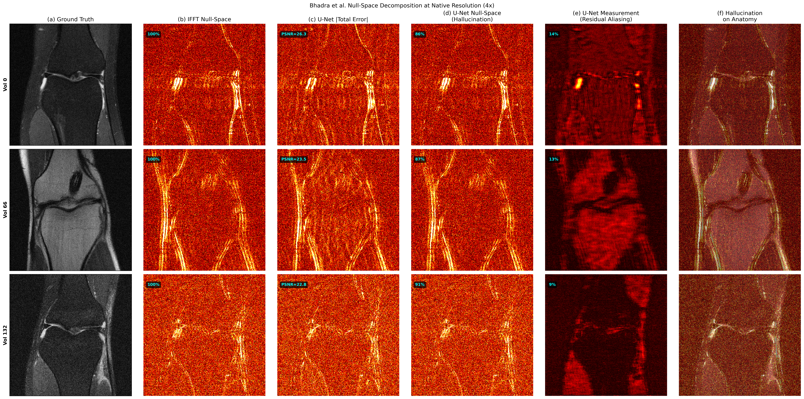
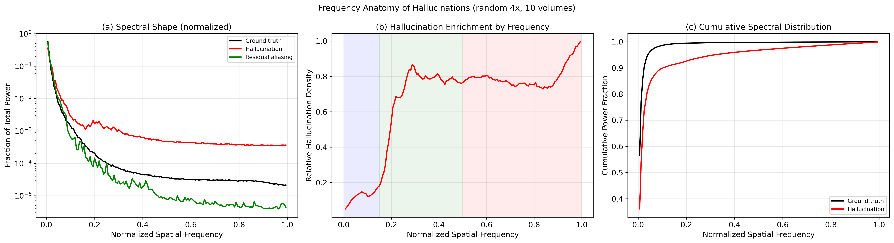
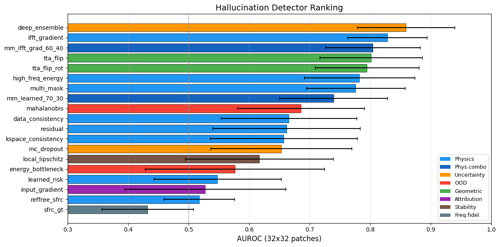

# Physics-Informed Hallucination Detection in Accelerated MRI

Benchmark of 22 hallucination detectors (6 families) for accelerated MRI reconstruction, evaluated on fastMRI single-coil knee data. The core idea: use null-space decomposition as ground truth to score detectors that don't need ground truth at inference.

> **Best GT-free detector: Deep Ensemble at 0.859 patch-level AUROC**, with IFFT Gradient (0.828) as the best zero-cost alternative.



*IFFT vs U-Net null-space decomposition: IFFT error is 100% null-space (predictable from physics). U-Net error splits into hallucinated content and residual aliasing.*

## Key Results

| Detector | AUROC | GT-Free | Cost |
|---|---|---|---|
| Deep Ensemble (3 models) | 0.859 ± 0.081 | Yes | 3 forward passes |
| IFFT Gradient | 0.828 ± 0.065 | Yes | Negligible |
| MM + IFFT Grad (60/40) | 0.804 ± 0.078 | Yes | 9 forward passes |
| TTA Flip | 0.801 ± 0.085 | Yes | 2 forward passes |
| Multi-Mask (8 masks) | 0.776 ± 0.082 | Yes | 8 forward passes |
| MC Dropout (p=0.05) | 0.653 ± 0.117 | Yes | 20 forward passes |
| Energy OOD | 0.576 ± 0.148 | Yes | Failed |
| sFRC GT | 0.432 ± 0.076 | No | Failed |

Hallucination ground truth is defined via Bhadra et al.'s null-space decomposition: the component of the reconstruction that has zero support in measured k-space.

## Findings



*PSF aliasing pattern predicts hallucination location with r = 0.95. Control experiment confirms this is mask-specific (drop to r = 0.66 with different mask).*

U-Net hallucinations constitute ~86% of reconstruction error at 4x acceleration. They concentrate in high frequencies (13.6x enrichment) and correlate strongly with the sampling PSF (r=0.95), confirming hallucinations are physics-driven, not anatomy-driven. Deep ensembles are the strongest single GT-free detector, while TTA flip achieves comparable performance at lower cost. MC dropout with standard rates (p=0.05) underperforms, and both energy-based OOD and spectral FRC methods fail entirely. Rankings are stable across 4x and 8x acceleration.

## Methods

**Null-space decomposition** (Bhadra et al., 2021) separates reconstruction error into data-consistent and hallucinated components. The hallucination map serves as ground truth for all detector evaluations.

**Physics-informed detectors** exploit the forward model: multi-mask disagreement probes sensitivity to sampling pattern changes, IFFT gradient measures deviation from the adjoint solution, and data consistency quantifies k-space residuals. **Uncertainty detectors** use stochastic inference: MC dropout, deep ensembles, and TTA horizontal flip.

Energy-based OOD detection and reference-free sFRC both failed (see table above). Energy scores don't transfer from classification to pixel-level tasks, and sFRC frequency correlation saturates with inverted direction.



*Full detector ranking across 19 methods and 6 families.*

## Dataset

[fastMRI](https://fastmri.med.nyu.edu/) single-coil knee: 973 training volumes, 199 validation volumes (7,135 slices). Random Cartesian masks at 4x and 8x acceleration with 8% center fraction. Must be downloaded separately after registration.

## Installation
```bash
git clone https://github.com/GuillaumeEsclozas/mri-hallucination-physics.git
cd mri-hallucination-physics
pip install -r requirements.txt
```

Requires Python 3.8+, PyTorch 2.0+, and a CUDA GPU.

## Usage

Five notebooks reproduce all results end-to-end on Google Colab (A100/L4 GPU):

| Notebook | Content |
|---|---|
| `01_data_exploration.ipynb` | Sanity checks: adjoint consistency, null-space validation |
| `02_reconstruction_baselines.ipynb` | U-Net training at 4x/8x, PSNR/SSIM |
| `03_hallucination_characterization.ipynb` | Null-space decomposition, PSF correlation, freq analysis |
| `04_physics_informed_detection.ipynb` | First 8 detectors, patch-level AUROC |
| `05_uncertainty_benchmark.ipynb` | All 19 detectors, cross-acceleration, detector combinations |

## Distributed Training

Training infrastructure for single GPU (Colab) and multi GPU clusters via PyTorch DDP. Configs use Hydra so switching between setups is one argument change.
```bash
# single gpu, synthetic data for testing
python train_ddp.py synthetic=true training.epochs=50

# multi gpu via torchrun
torchrun --standalone --nproc_per_node=4 train_ddp.py training=multi_gpu

# deep ensemble (loops over seeds automatically)
python train_ddp.py detector=deep_ensemble
```

The training loop handles mixed precision with GradScaler, gradient clipping (configurable via `training.max_grad_norm`), and a linear warmup into cosine annealing schedule. NaN batches don't deadlock DDP because backward is always called regardless of loss value, and GradScaler skips the optimizer step when it detects inf gradients.

Extended training (200 epochs, 150 volumes, 4x acceleration) reached val L1 = 0.0378, down from the 50 epoch baseline at 0.0433. Most of the gain comes from warmup and gradient clipping rather than just training longer (at epoch 50 the new pipeline is already at 0.0404).

### Scaling results

Measured on 4x H100 SXM (NVLink), weak scaling with batch_size=8 per GPU:

| GPUs | Throughput (samples/sec) | Speedup | Efficiency |
|------|--------------------------|---------|------------|
| 1    | 360.8                    | 1.00x   | 100%       |
| 2    | 407.7                    | 1.13x   | 56.5%      |
| 4    | 736.2                    | 2.04x   | 51.0%      |

The model is small (7.7M params, 320x320 images) so gradient allreduce dominates over compute. This is expected for communication bound workloads. Larger architectures like VarNet or unrolled networks would show better scaling.

### HPC infrastructure

SLURM job scripts are in `slurm/` (single node and array sweep for detector benchmarks). They target generic SLURM clusters. UGent HPC uses a PBS/Torque frontend over SLURM, see comments in the sbatch files for adaptation notes.

Container setup: Dockerfile from NGC PyTorch 24.01 base image, Apptainer build script for UGent clusters (images must live on `$VSC_SCRATCH`). See `docker/`.

Other tooling: `scripts/prepare_data.py` validates the fastMRI directory layout, `scripts/aggregate_results.py` collects best checkpoints into a summary table, `scaling_benchmark.py` runs the throughput measurements.

<details>
<summary><b>What didn't work (and what I learned)</b></summary>

### Detection methods that failed

**Energy-based OOD detection** (0.576 AUROC). Energy scores were designed for classification logits, not pixel-level regression. The score distribution for hallucinated vs clean patches overlaps almost entirely. Doesn't transfer to reconstruction tasks.

**Spectral FRC** (0.432 AUROC, worse than random). The frequency ring correlation between reconstruction and ground truth saturates at high frequencies and the correlation direction inverts. Reference-free sFRC inherits this problem. We spent a full notebook iteration trying different ring widths and normalization schemes before concluding the metric is fundamentally unsuited for hallucination detection at these acceleration factors.

**MC Dropout at p=0.05** (0.653 AUROC). The default dropout rate is too low to produce meaningful variance across forward passes. Higher rates (p=0.2+) would help but degrade reconstruction quality during training. Deep ensembles achieve the same goal (epistemic uncertainty) without this tradeoff.

### DDP and infrastructure issues

**NaN skip deadlocks DDP.** Our first training loop used `continue` to skip batches with NaN loss. Under DDP this hangs forever because the skipping rank never calls `backward()`, and the other ranks block on gradient allreduce. Fix: always call backward, let GradScaler handle inf gradients, zero out NaN contributions from the loss accumulator after the fact.

**Google Drive FUSE dies under HDF5 random access.** Every training run that read directly from Drive eventually hit `OSError: Transport endpoint is not connected`. The FUSE mount can't handle the random read pattern of HDF5 datasets. Fix: always copy data to local SSD before training. This cost us several failed runs before we learned to never trust Drive for HDF5.

**mp.spawn + NCCL on cloud pods.** On RunPod with PCIe-connected A40 GPUs (SYS interconnect), `mp.spawn` based benchmarking produced 0.57x "scaling" on 2 GPUs and hung on 4. The combination of slow inter-NUMA PCIe and mp.spawn's process management made DDP unusable. Switching to `torchrun` and NVLink-connected H100 SXM resolved both problems. Lesson: interconnect topology matters more than raw GPU power for DDP.

**Port conflicts in spawned processes.** Early versions called `find_free_port()` inside each child process spawned by `mp.spawn`. Each child found a different port, so they never connected. The port must be determined once in the parent and passed to all children.

**Stale module cache in Colab.** After `%%writefile` rewrites a `.py` file, Python still imports the cached old version. Every rewrite needs `importlib.reload()`. We hit this at least three times before making it a habit.

**Warmup LR direction confusion.** With `warmup_epochs=1`, the warmup completes by the end of epoch 1 (LR reaches peak). Epoch 2 starts cosine decay, so LR drops. Our first test asserted LR should increase from epoch 1 to epoch 2, which was backwards. Small thing, but representative of the kind of off-by-one reasoning that DDP scheduling requires.

</details>

## References

- Bhadra et al. (2021). *On hallucinations in tomographic image reconstruction.* IEEE TMI, 40(11).
- Peck, Bugday & Saeys (2026). *Triggering hallucinations in model-based MRI reconstruction via adversarial perturbations.* arXiv:2602.18536.
- Theunissen, Mortier, Saeys & Waegeman (2025). *Evaluation of out-of-distribution detection methods.* Briefings in Bioinformatics, 26(3).
- Gottschling, Antun, Hansen & Adcock (2025). *The troublesome kernel.* SIAM Review, 67:73-104.
- Kc, Zeng, Soni & Badano (2024). *sFRC for assessing hallucinations in medical image restoration.* FDA/CDRH.
- Lustig, Donoho & Pauly (2007). *Sparse MRI.* MRM, 58(6).
- Zbontar et al. (2018). *fastMRI: An open dataset and benchmarks for accelerated MRI.* arXiv.
- Shimron, Tamir, Wang & Lustig (2022). *Implicit data crimes.* PNAS, 119(13).
- Ronneberger, Fischer & Brox (2015). *U-Net.* MICCAI.
- Lakshminarayanan et al. (2017). *Simple and scalable predictive uncertainty estimation using deep ensembles.* NeurIPS.

## License

MIT

## Acknowledgments

Built on the fastMRI dataset (NYU Langone). Hallucination framework follows Bhadra et al. and extends the detection methodology from Jonathan Peck and Lauren Theunissen's work at SaeysLab, UGent.
